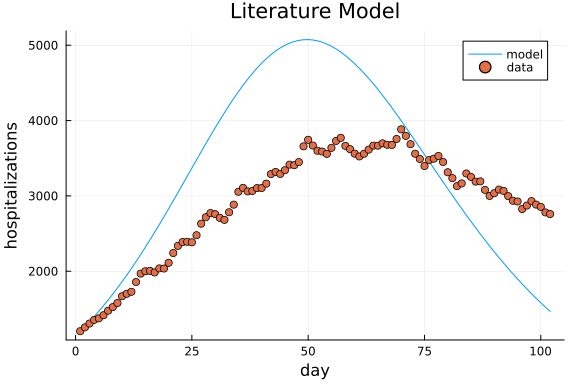
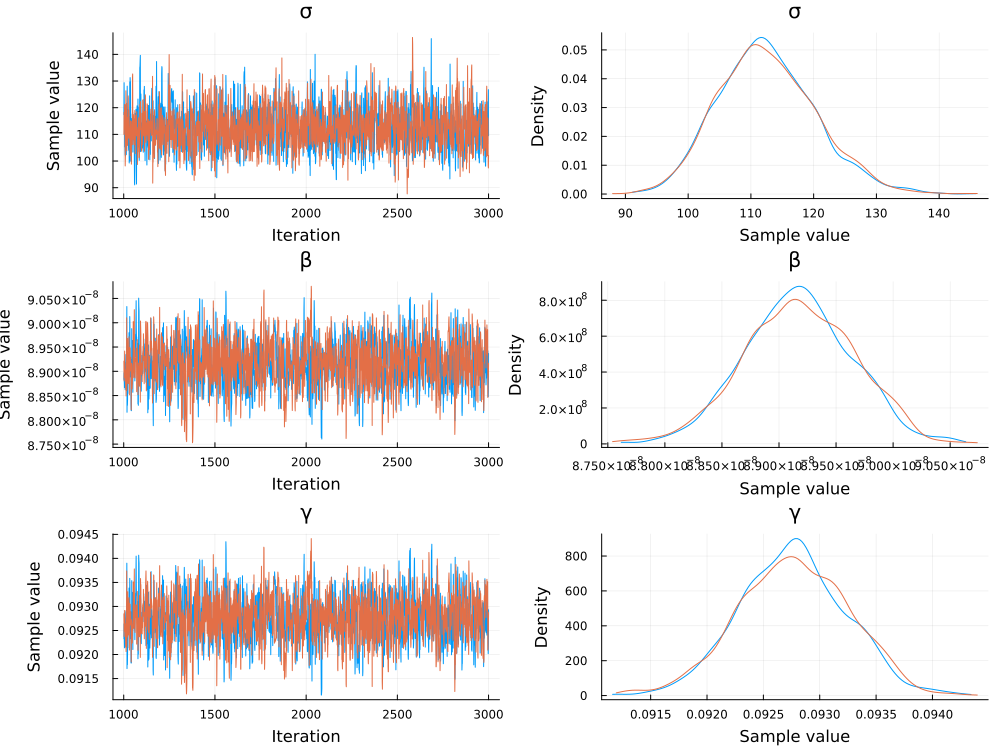
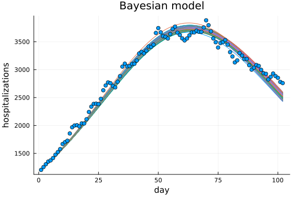
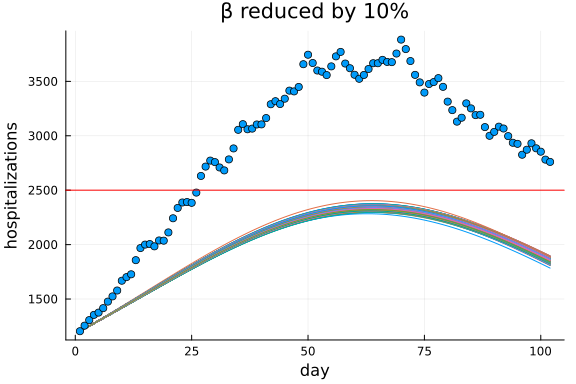
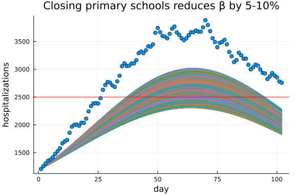
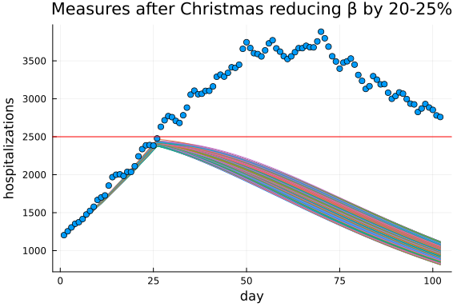

In this tutorial we will model [Covid hospitalizations in New York City between December 2020 and March 2021,](https://health.data.ny.gov/Health/New-York-State-Statewide-COVID-19-Hospitalizations/jw46-jpb7/explore/query/SELECT%0A%20%20%60as_of_date%60%2C%0A%20%20sum%28%60patients_currently%60%29%20AS%20%60sum_patients_currently%60%0AWHERE%0A%20%20%28%60ny_forward_region%60%20IN%20%28%27NEW%20YORK%20CITY%27%29%29%0A%20%20AND%20%28%60as_of_date%60%0A%20%20%20%20%20%20%20%20%20BETWEEN%20%272020-12-01T00%3A00%3A00%27%20%3A%3A%20floating_timestamp%0A%20%20%20%20%20%20%20%20%20AND%20%272021-04-01T00%3A00%3A00%27%20%3A%3A%20floating_timestamp%29%0AGROUP%20BY%20%60as_of_date%60/page/column_manager).
and look at how some possible interventions could have played out.
```julia
using CSV
using DataFrames
hospitalization_data = CSV.read("dataset.csv", DataFrame)
```

```
102×2 DataFrame
 Row │ Date        Hospitalized
     │ String15    Int64
─────┼──────────────────────────
   1 │ 12/01/2020          1204
   2 │ 12/02/2020          1255
   3 │ 12/03/2020          1306
   4 │ 12/04/2020          1354
   5 │ 12/05/2020          1375
   6 │ 12/06/2020          1416
   7 │ 12/07/2020          1476
   8 │ 12/08/2020          1524
  ⋮  │     ⋮            ⋮
  96 │ 03/06/2021          2826
  97 │ 03/07/2021          2872
  98 │ 03/08/2021          2931
  99 │ 03/09/2021          2885
 100 │ 03/10/2021          2854
 101 │ 03/11/2021          2781
 102 │ 03/12/2021          2760
                 87 rows omitted
```


From the epidemiology literature, we know that [CHIME](https://code-for-philly.gitbook.io/chime/what-is-chime/parameters) is a good starting place to model such data.
CHIME models the evolution of the disease using the following differential equations:
$$\begin{align}
    \frac{dS}{dt} = -βSI\\\\
    \frac{dI}{dt} = βSI - γI\\\\
    \frac{dR}{dt} = + γI\\\\
    H = δI.
\end{align}$$
In these equations $S$ stands for the number of people susceptible to COVID-19, $I$ for infected, $R$ for removed and $H$ for hospitalized.
The goal is to estimate the parameters $β$, $γ$ and $δ$ from the experimental data.

## Identifiability
A first question to ask yourself is whether these parameters can be identified using only only hospitalization data.
```julia
using StructuralIdentifiability
ode = @ODEmodel(
           S'(t) = -β*S(t)*I(t),
           I'(t) = β*S(t)*I(t) - γ*I(t),
           R'(t) = γ*I(t),
           H(t) = δ*I(t)
       )
global_id = assess_identifiability(ode, 0.999)
```

```
Dict{Any, Symbol} with 3 entries:
  γ => :globally
  δ => :nonidentifiable
  β => :nonidentifiable
```


It turns out that hospitalization data is not sufficient to infer all the parameters,
different combinations of parameters will give the exact same input-output behavior.
One way to solve this issue is to gather more data,
for example using the number of positive and negative COVID-19 tests.
Another way to solve this issue is to dive into the literature to find values for some of the parameters.
Let us take this second route and find that 5% is a good estimate of the number of infected people which become hospitalized.
```julia
ode = @ODEmodel(
           S'(t) = -β*S(t)*I(t),
           I'(t) = β*S(t)*I(t) - γ*I(t),
           R'(t) = γ*I(t),
           H(t) = 5/100*I(t)
       )
global_id = assess_identifiability(ode, 0.999)
```

```
Dict{Any, Symbol} with 2 entries:
  β => :globally
  γ => :globally
```


Now the model is identifiable.
```julia
using BenchmarkTools
@btime assess_identifiability(ode, 0.999);
```

```
8.265 ms (76726 allocations: 10.72 MiB)
```


## Simulating the model
The initial number of susceptible people can be based on the population size of New York City.
The initial number of infected people is determined by the hospitalizations at the first day.
The initial condition of the final state does not matter for inferring the model parameters,
Since the removed people no longer interact with either susceptible or infected people.
Let us simulate the system for an initial guess of $γ$ and $β$.
```julia
using OrdinaryDiffEq
# assumed parameters from literature
hospitalization_rate = 0.05
S0 = 1_400_000.0
I0 = hospitalization_data[1,:Hospitalized]/hospitalization_rate
R0 = 0.0
u0 = [S0,I0,R0]
γ_guess = 1/9
β_guess = (2^(1/14)-1 + γ_guess)/S0
p = [β_guess,γ_guess]
# dynamics
function SIR(du, u, p, t)
    # Model parameters.
    β, γ = p
    # Current state.
    S, I, R = u
    # Evaluate differential equations.
    du[1] = dS = -β*S*I
    du[2] = dI = β*S*I - γ*I
    du[3] = dR = γ*I
    return nothing
end
# Solve the model for the initial guess of the parameters
days = 1:size(hospitalization_data,1)
tspan = (days[begin],days[end])
prob = ODEProblem(SIR,u0,tspan,p,saveat=days)
sol = solve(prob,Tsit5())
using Plots; plot(days, sol[2,:]*hospitalization_rate,label="model");
scatter!(days,hospitalization_data[!,:Hospitalized],label="data");
plot!(;xlabel="day",ylabel="hospitalizations",title="Literature Model")
```




These parameters don't do a terrible job at approximating the measured hospitalizations,
but we can still fine-tune these parameters some more using Bayesian inference.
```julia
@btime solve(prob,Tsit5());
```

```
13.900 μs (160 allocations: 17.94 KiB)
```


## Bayesian inference
We use the NUTS algorithm to generate 2 Markov-chains of 2000 steps,
with prior distributions for $β$ and $γ$ informed by the epidemiology literature.
```julia
using Turing
@model function fitCHIME(hospitalized, prob, hospitalization_rate)
    # Prior distributions informed by literature.
    σ ~ Uniform(0.0,1000.0)
    β ~ Uniform(0.05e-6,0.25e-6)
    γ ~ Uniform(0.05,0.25)

    p = [β, γ]
    u0 = [S0,I0,R0]
    # Simulate the SIR model
    predicted = solve(prob, Tsit5(); p=p)
    failure = size(predicted, 2) < length(prob.kwargs.data.saveat)
    if failure
        println("failure solving the ODE")
        Turing.DynamicPPL.acclogp!!(__varinfo__, -Inf)
        return
    end

    # Likelihood of observations.
    for i in eachindex(predicted)
        hospitalized[i] ~ Normal(predicted[2,i]*hospitalization_rate, σ)
    end
    return nothing
end
model = fitCHIME(hospitalization_data[!,:Hospitalized], prob, hospitalization_rate)
chain = sample(model, NUTS(0.65), MCMCThreads(), 2_000, 2)
#write("chain-file.jls", chain)
#chain = read("chain-file.jls", Chains)
using StatsPlots; plot(chain)
```




The posterior distribution are peaked quite sharply compared to the priors.
This inference is quite fast in Julia!
```julia
@btime sample(model, NUTS(0.65), MCMCThreads(), 2_000, 2);
```

```
18.166 s (248728356 allocations: 20.51 GiB)
```


We can also do a posterior predictive check.
```julia
βdata = chain[:β]
γdata = chain[:γ]

function prob_func(prob,i,repeat)
    β = βdata[i]
    γ = γdata[i]
    p = [β,γ]
    remake(prob,p=p)
end
function output_func(sol,i)
    sol[2,:]*hospitalization_rate, false
end
ens_prob = EnsembleProblem(prob,prob_func=prob_func,output_func=output_func)
sim = solve(ens_prob,Tsit5(),trajectories=length(βdata))
plot(;legend=false,xlabel="day",ylabel="hospitalizations",title="Bayesian model");
for i in eachindex(sim)
    plot!(days, sim[i]);
end
scatter!(days,hospitalization_data[!,:Hospitalized],label="data")
```




We see that our model now nicely fits the data.
## Interventions
Now let us go over some possible interventions, trying to get hospitalizations below 2500.
First let us see what happens if $β$ is reduced by 10%.
```julia
function prob_func(prob,i,repeat)
    β = βdata[i]*0.9
    γ = γdata[i]
    p = [β,γ]
    remake(prob,p=p)
end
function output_func(sol,i)
    sol[2,:]*hospitalization_rate, false
end
ens_prob = EnsembleProblem(prob,prob_func=prob_func,output_func=output_func)
sim = solve(ens_prob,Tsit5(),trajectories=length(βdata))
plot(;legend=false, title="β reduced by 10%",xlabel="day",ylabel="hospitalizations");
for i in eachindex(sim)
    plot!(days, sim[i]);
end
scatter!(days,hospitalization_data[!,:Hospitalized],label="data");
hline!([2500.0],c=:red,ms=10)
```




Of course we can not directly change $β$ by a certain percentage,
but assume we read in literature that closing primary schools changes $β$ by 5 to 10%
```julia
function prob_func(prob,i,repeat)
    β = βdata[i]*rand(Uniform(0.9,0.95))
    γ = γdata[i]
    p = [β,γ]
    remake(prob,p=p)
end
function output_func(sol,i)
    sol[2,:]*hospitalization_rate, false
end
ens_prob = EnsembleProblem(prob,prob_func=prob_func,output_func=output_func)
sim = solve(ens_prob,Tsit5(),trajectories=length(βdata))
plot(;legend=false, title="Closing primary schools reduces β by 5-10%",xlabel="day",ylabel="hospitalizations");
for i in eachindex(sim)
    plot!(days, sim[i]);
end
scatter!(days,hospitalization_data[!,:Hospitalized],label="data");
hline!([2500.0],c=:red,ms=10)
```




We can also investigate the effect of a more severe but delayed intervention.
This is achieved using a callback in the differential equation solver.
```julia
function prob_func(prob,i,repeat)
    β = βdata[i]
    γ = γdata[i]
    p = [β,γ]
    remake(prob,p=p)
end
function output_func(sol,i)
    sol[2,:]*hospitalization_rate, false
end
condition(u,t,integrator) = t==26
affect!(integrator) = integrator.p[1] *= rand(Uniform(0.75,0.8))
cb = DiscreteCallback(condition,affect!,save_positions=(false,false))
ens_prob = EnsembleProblem(prob,prob_func=prob_func,output_func=output_func)
sim = solve(ens_prob,Tsit5(),trajectories=length(βdata),callback=cb,tstops=[26])
plot(;legend=false, title="Measures after Christmas reducing β by 20-25%",xlabel="day",ylabel="hospitalizations");
for i in eachindex(sim)
    plot!(days, sim[i]);
end
scatter!(days,hospitalization_data[!,:Hospitalized],label="data");
hline!([2500.0],c=:red,ms=10)
```



```julia
@btime solve(ens_prob,Tsit5(),trajectories=length(βdata),callback=cb,tstops=[26]);
```

```
72.026 ms (769477 allocations: 82.73 MiB)
```


